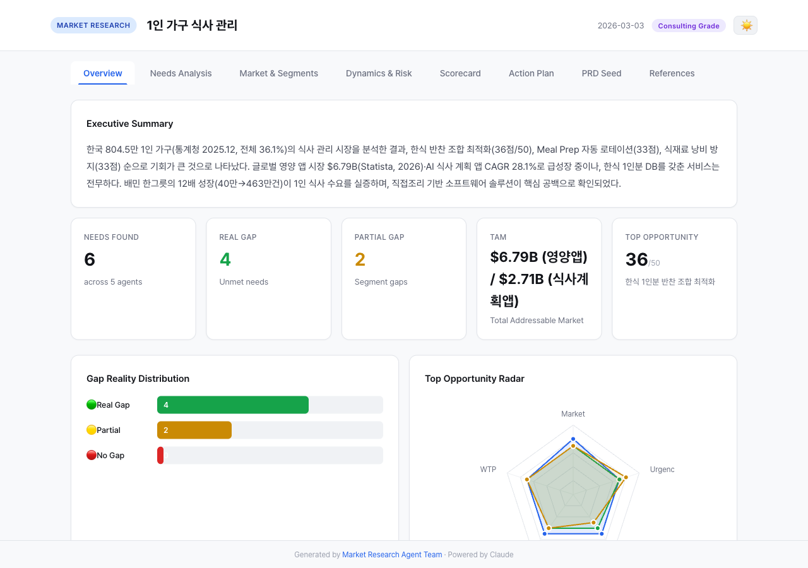
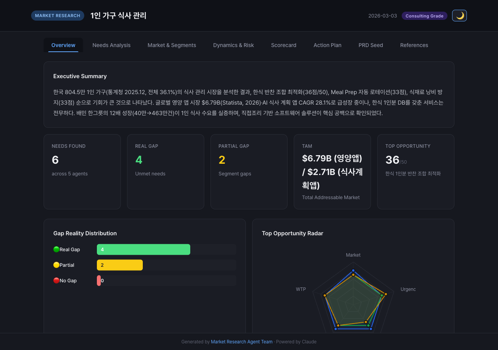
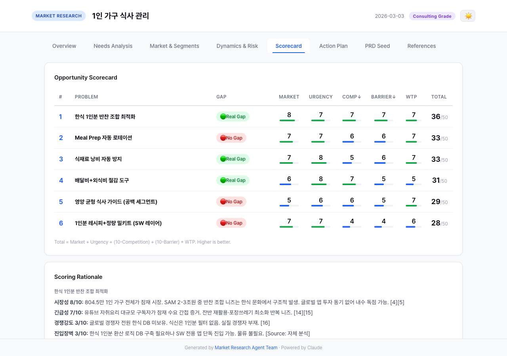
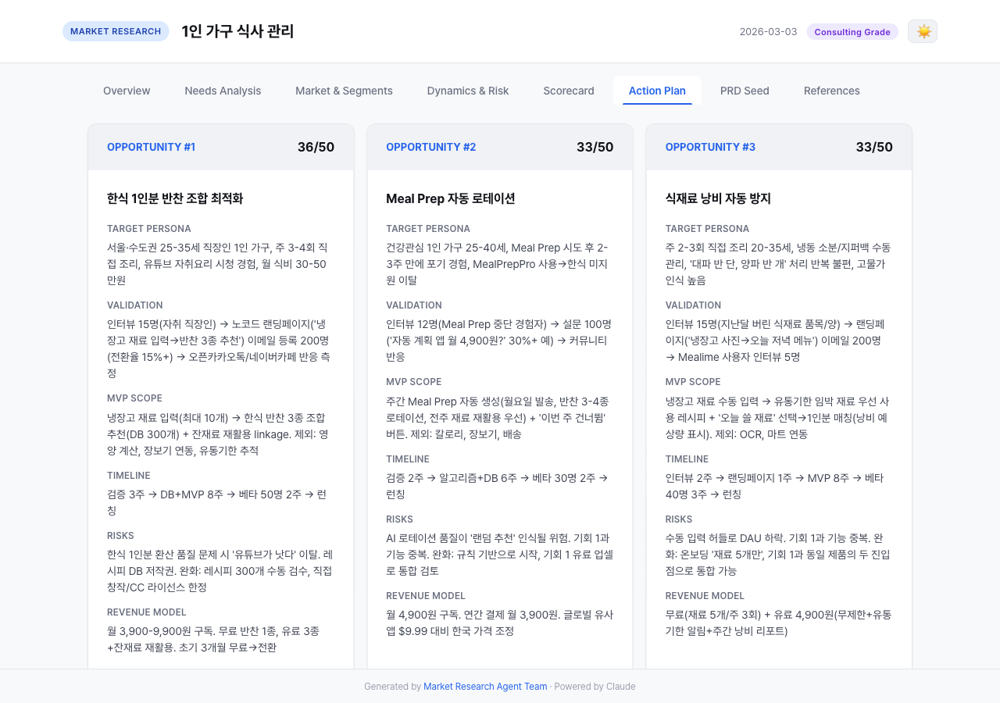

# Market Research Agent Team

> AI-powered multi-agent market research system for Claude Code
> 5 specialized agents working in parallel to deliver comprehensive opportunity analysis

<p align="center">
  
</p>

<details>
<summary><b>More Screenshots</b></summary>

| Dark Mode | Scorecard | Action Plan |
|-----------|-----------|-------------|
|  |  |  |

</details>

## What It Does

`/market-research [topic]` 한 줄로 실행하면, 5개 AI 에이전트가 병렬로 시장 조사를 수행하고 **인터랙티브 HTML 리포트**를 생성합니다.

**30초 요약:**
1. 주제 입력 (예: "1인 가구 식사 관리")
2. 5개 에이전트가 3단계(Phase)로 자동 조사
3. 점수카드, 액션플랜, PRD 시드가 포함된 리포트 출력

## Demo

`demo-sample/report.html`을 브라우저에서 열면 **"1인 가구 식사 관리"** 주제의 완성된 리포트를 확인할 수 있습니다.

```bash
open demo-sample/report.html
```

### Report Tabs

| Tab | Content | Depth |
|-----|---------|-------|
| **Overview** | Executive Summary, 핵심 지표 카드, Gap Reality 차트, 레이더 차트 | All |
| **Needs Analysis** | 미충족 니즈 상세 (페르소나, workaround, 기존 솔루션, 실패 원인) | All |
| **Market & Segments** | TAM/SAM/SOM, 경쟁 포지셔닝, 경쟁 환경 맵, 세그먼테이션 | Standard+ |
| **Dynamics & Risk** | 성장 동인, 리스크 매트릭스, Value Chain | Consulting |
| **Scorecard** | 기회 점수 테이블 + 채점 근거 | Standard+ |
| **Action Plan** | 상위 3개 기회별 검증-MVP-런칭 플랜 | Standard+ |
| **PRD Seed** | 1위 기회의 PRD 초안 (문제정의, 시장근거, 솔루션방향) | Standard+ |
| **References** | 전체 출처 목록 (Tier별 색상 배지) | Consulting |

> 데모 리포트는 Consulting Grade로 생성되어 전체 탭이 표시됩니다.

## Features

| Feature | Description |
|---------|-------------|
| **5-Agent Pipeline** | Trend Scanner, Community Analyst, Deep Researcher, Local Specialist, Strategist |
| **3-Phase Parallel** | Phase 1 (수집) → Phase 2 (검증) → Phase 3 (전략) — 병렬 실행으로 속도 최적화 |
| **Gap Reality System** | 🟢 Real Gap / 🟡 Partial Gap / 🔴 No Gap — 경쟁 검증 기반 기회 판정 |
| **Opportunity Scorecard** | 시장성, 긴급성, 경쟁강도, 진입장벽, WTP — 50점 만점 정량 평가 |
| **Interactive HTML Report** | 탭 기반 UI, 다크/라이트 테마, 반응형 디자인, SVG 레이더 차트 |
| **3-Tier Source System** | T1 (정부 통계/MBB) / T2 (업계) / T3 (커뮤니티) — 출처 신뢰도 분류 + 최신성 규칙 + 발행일 표시 |
| **Locale Support** | 한국 시장 전문 분석 + 커스텀 로케일 지원 |
| **Caching** | 이전 조사 결과 캐싱, Phase 1 스킵으로 업데이트 조사 가능 |

---

## Getting Started

### Prerequisites

- [Claude Code](https://docs.anthropic.com/en/docs/claude-code) CLI 설치
- Claude Code에서 `WebSearch`, `WebFetch` 도구 접근 가능

### Installation

1. **Skill 파일 복사:**

```bash
mkdir -p ~/.claude/skills/market-research
cp skill/SKILL.md ~/.claude/skills/market-research/
cp skill/prompts.md ~/.claude/skills/market-research/
cp skill/report-template.html ~/.claude/skills/market-research/
```

2. **Agent 정의 파일 복사:**

```bash
mkdir -p ~/.claude/agents
cp agents/market-*.md ~/.claude/agents/
```

3. **출력 디렉토리 설정 (선택):**

```bash
# 기본: ~/Market_Research/{slug}/
export MR_OUTPUT_DIR="/your/preferred/path"
```

### Usage

Claude Code에서 실행:

```
/market-research 1인 가구 식사 관리
```

실행 시 2가지를 선택합니다:

1. **로케일** — 글로벌 전용 / 한국 시장 (추천) / 커스텀
2. **품질 모드** — 일반 (Sonnet) / 프리미엄 (Opus)

### Caching

같은 주제로 재조사 시 이전 결과를 감지하고 옵션을 제공합니다:
- **전체 재조사** — Phase 1부터 새로 시작
- **업데이트 조사** — Phase 1 결과 재사용, Phase 2부터 실행
- **이전 결과 보기** — 기존 리포트 열기

---

## How It Works

### Architecture

```
        ┌────────────────────────────────────────────────────┐
        │               Team Leader (Main)                   │
        │          Orchestrate · Compress · Output           │
        └─┬───────────────────────┬────────────────────────┬─┘
          │                       │                        │
 ┌────────┴────────┐     ┌────────┴────────┐     ┌─────────┴─────────┐
 │    Phase 1      │     │    Phase 2      │     │     Phase 3       │
 │   (parallel)    │     │   (parallel)    │     │   (sequential)    │
 ├────────┬────────┤     ├────────┬────────┤     ├───────────────────┤
 │ Trend  │  Comm  │     │  Deep  │ Local  │     │    Strategist     │
 │Scanner │Analyst │     │Resrch. │ Spec.  │     │                   │
 │(haiku) │(haiku) │     │(sonnet)│(sonnet)│     │   sonnet / opus   │
 └────────┴────────┘     └────────┴────────┘     └───────────────────┘
  PH,HN,X  Reddit        G2,Cap   Korea          Scorecard
  trends    Blind         terra    Market         Action Plan
```

| Phase | Agents | Model | Tasks | Output |
|-------|--------|-------|-------|--------|
| **1. Collect** | Trend Scanner + Community Analyst | haiku x2 | PH/HN/X 트렌드, Reddit/블라인드 불만 패턴 | 미충족 니즈 목록 |
| **2. Verify** | Deep Researcher + Local Specialist | sonnet x2 | 경쟁사 검증, Gap Reality 판정, TAM/SAM/SOM | 정규화 테이블 |
| **3. Strategize** | Strategist | sonnet/opus | 점수카드, 액션플랜, PRD 시드 | 최종 전략 |

### Methodology

#### Scorecard Formula

```
Total = Market + Urgency + (10 - Competition) + (10 - Barrier) + WTP
```

| Dimension | Range | Description |
|-----------|-------|-------------|
| Market (시장성) | 0-10 | 시장 규모와 성장 잠재력 |
| Urgency (긴급성) | 0-10 | 문제의 빈도와 심각도 |
| Competition (경쟁강도) | 0-10 | 높을수록 진입 어려움 (역산) |
| Barrier (진입장벽) | 0-10 | 높을수록 구축 어려움 (역산) |
| WTP (지불의사) | 0-10 | 커뮤니티 증거 기반 |

> **Gap Reality 연동:** 🔴 No Gap → 상위 3개에서 제외. 🟡 Partial → 공백 세그먼트만 채점.

#### Gap Reality System

| 판정 | 기준 | Scorecard 반영 |
|------|------|---------------|
| 🟢 **Real Gap** | 3회 이상 검색에도 직접 해결 서비스 미발견 | 전체 채점 |
| 🟡 **Partial Gap** | 기존 솔루션 존재하나 특정 세그먼트 공백 | 공백 세그먼트만 채점 |
| 🔴 **No Gap** | 충분한 서비스 2개 이상, 포화 상태 | 상위 3개에서 제외 |

#### Source Tier System

| Tier | Label | Examples | Badge |
|------|-------|----------|-------|
| **T1** | Authoritative | 정부 통계(통계청, OECD), MBB 공개 리포트(McKinsey, Bain, BCG), Statista 공개 차트, 학술 논문, 기업 공시 | 🔵 Blue |
| **T2** | Industry | G2, Capterra, Product Hunt, TechCrunch, 유료 리포트 랜딩 페이지(Grand View Research 등) | 🟣 Purple |
| **T3** | Community | Reddit, Hacker News, Blind, Twitter/X | ⚪ Gray |

> **최신성 규칙:** 시장 규모/통계 데이터는 2024년 이후 자료만 인용. 2022년 이하 자료는 MBB라도 인용 금지. 모든 출처에 발행 연도 병기.

---

## Output

### File Structure

```
{output-dir}/{slug}/
├── report.html          # 인터랙티브 HTML 리포트 (메인 결과물)
├── report.md            # 마크다운 보고서
├── scorecard.md         # 기회 점수카드
├── action-plan.md       # 액션플랜
├── prd-seed.md          # PRD 시드
├── meta.md              # 메타데이터 (캐싱용)
└── raw/                 # 에이전트 원본 출력
    ├── trend-scan.md
    ├── community.md
    ├── deep-research.md
    └── korea-market.md
```

---

## Reference

### Project Structure

```
market-research/
├── skill/
│   ├── SKILL.md                  # 오케스트레이션 로직
│   ├── prompts.md                # 에이전트 프롬프트 템플릿
│   └── report-template.html      # HTML 리포트 템플릿 (65KB)
├── agents/
│   ├── market-trend-scanner.md    # Phase 1: 트렌드 수집 (haiku)
│   ├── market-community-analyst.md # Phase 1: 커뮤니티 분석 (haiku)
│   ├── market-deep-researcher.md  # Phase 2: 경쟁 검증 (sonnet)
│   ├── market-korea-specialist.md # Phase 2: 한국 시장 (sonnet)
│   ├── market-local-specialist.md # Phase 2: 커스텀 로케일 (sonnet)
│   └── market-strategist.md       # Phase 3: 전략 수립 (sonnet/opus)
└── demo-sample/
    ├── demo-data.json             # 샘플 데이터
    └── report.html                # 생성된 데모 리포트
```

### Configuration

| Variable | Default | Description |
|----------|---------|-------------|
| `MR_OUTPUT_DIR` | `~/Market_Research` | 리포트 출력 디렉토리 |

| Agent | Default Model | Configurable |
|-------|---------------|--------------|
| Trend Scanner | haiku | Fixed |
| Community Analyst | haiku | Fixed |
| Deep Researcher | sonnet | Fixed |
| Local Specialist | sonnet | Fixed |
| Strategist | sonnet | sonnet/opus (품질 모드 선택) |

### Security & Accessibility

- **XSS Prevention:** 전체 HTML entity escaping + URL protocol validation (`safeUrl()`)
- **URL Sanitization:** `http:`/`https:` 프로토콜만 허용, `javascript:` 등 차단
- **Data Isolation:** 각 서브에이전트는 독립 컨텍스트에서 실행
- **WCAG 2.1 AA:** Tab 키보드 내비게이션, 아코디언 Enter/Space 접근성, 다크 모드 대비 비율 확보

### Limitations

- 유료 시장 리포트 (Gartner, Forrester, Euromonitor) 미포함 — 공개 데이터만 사용
- 정량 데이터는 공개 출처 한정 — 실제 TAM/SAM은 변동 가능
- 사용자 인터뷰 미실시 — 커뮤니티 데이터로 대체
- WebSearch 결과에 의존 — 검색 품질에 따라 결과 변동

## License

MIT

## Credits

Built with [Claude Code](https://claude.ai/claude-code) using the Claude Agent SDK.
